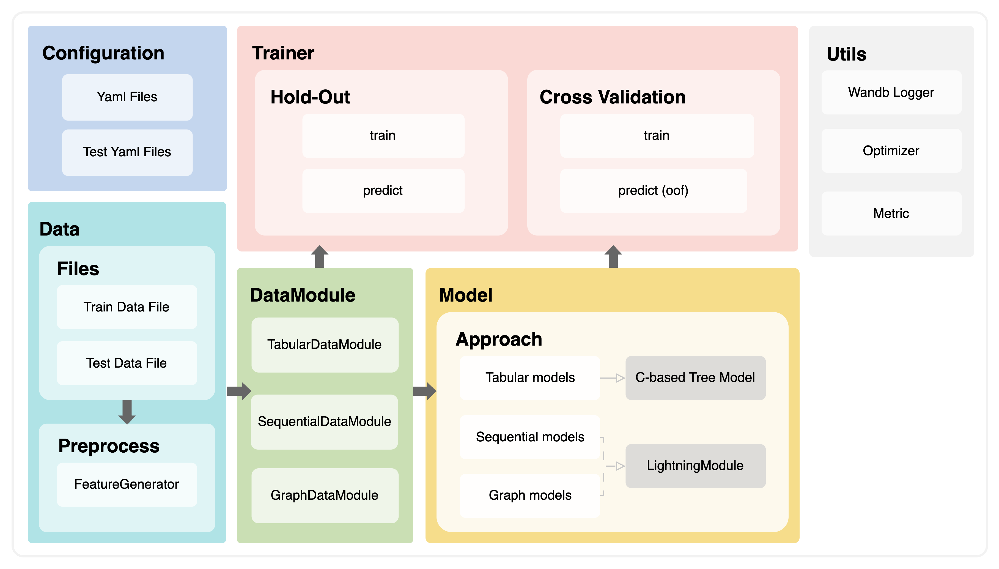

<div align="center">
  <br>
  
  <h1>Level2 DKT</h1>
  <strong>Deep Knowledge Tracing</strong>
  <br>
  <strong>Recsys-03 Recdol</strong>
  <br>
</div>
<br>
<p align="center">
  
  
  
  
  
  
  
  
</p>

## 개요
DKT 는 딥러닝 방법론으로, 학생의 지식상태를 추적하는데 사용됩니다.

시험은 학생이 얼마만큼 아는지 평가하는 좋은 방법입니다. 시험 성적이 높은 과목은 이미 잘 아는 것을 나타내고 시험 성적이 낮은 과목은 반대로 공부가 더욱 필요함을 나타냅니다. 그러나 시험은 개인의 맞춤화된 피드백을 제공하기 어렵습니다. 이를 보완하기 위해 Deep Knowledge Tracing(DKT)를 사용할 수 있습니다.  

다만 이번 프로젝트에서는 학생 개개인의 지식상태를 예측하기 보다는, 아직 **풀지 않은(Unseen) 문제에 대한 정오답을 예측**하는 것을 목표로 합니다. 
Iscream 데이터셋을 이용하여 각 학생의 푼 문제 목록과 정답 여부를 통해 최종 문제에 대한 정답 확률을 예측했습니다.

## 구조도
본 프로젝트는 tabular, sequential, graph approach로 구성되어 있습니다.


## 모델

### Graph
- LightGCN: 이웃 노드의 임베딩의 가중합으로 GCN을 적용한 모델

### Sequential
- LSTM
- LSTMATTN: LSTM에 Attention을 더한 모델
- GRUATTN: LSTM보다 일반적으로 더 적은 양의 데이터셋에서 잘 동작하는 GRU에 Attention을 더한 모델
- BERT: Transformer의 인코더를 사용하는 모델
- GPT2: Transformer 의 decoder 스택만 사용하는 모델
- LQTR: 트랜스포머 인코더에 LSTM, DNN을 더했으며 인코더에서 마지막 쿼리만 사용한 모델
- SAINT+: Transformer에 시간 정보를 활용한 모델

### Tabular
- LightGBM
- CatBoost
- XGBoost


## 결과
- public 4위 (AUC: 0.8227)
- private 3위 (AUC: 0.8577)

## 구성원 및 역할
|  |  |  |  |  |
| :---: | :---: | :---: | :---: | :---: |
| [강찬미](https://github.com/kCMI113) | [박동연](https://github.com/DyeonPark) | [서민석](https://github.com/alstjrdlzz) | [이준영](https://github.com/2jun0) | [주혜인](https://github.com/juhyein) |
- **강찬미**: EDA, LQTR/catboost 구현 및 HPO, T-fix up 구현, github action workflow 작성, Feature Engineering
- **박동연**: Sequential baseline 구축, GPT2/GRUATTN 구현, Ensemble 구현, GPT2 & LSTMATTN HPO
- **서민석**: Tabular baseline 구축, Feature Engineering, LightGBM HPO
- **이준영**: EDA, XGBoost, Saint+ 구현 및 HYPO, 코드 테스트 구현, Feature Engineering
- **주혜인**: Graph baseline 구축, Data Augmentation, LightGCN & LSTM HPO

## Setting
### How to set pre-commit config

```bash
pip install pre-commit
pre-commit install
```

### [Graph approach](./graph/README.md)

### [Sequential approach](./sequential/README.md)

### [Tabular approach](./tabular/README.md)

## Further Reading
- [랩업 리포트](./docs/pdfs/report.pdf)
- [발표 자료](./docs/pdfs/presentation.pdf)
